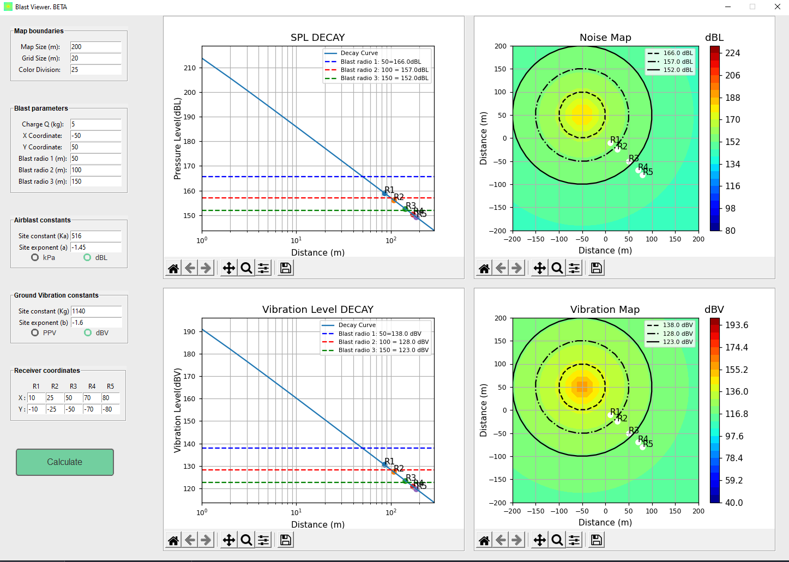

## Airblast Overpressure and Ground Vibration Mapping

This repository contains the python script and executable program for visualization and estimation of the overpressure and vibration levels of a single blasting charge.

In order to see the code go to the "CODE" folder and you will be able so the see it with its requirements, on the other hand if you just want to run the program just download the entire "Executable program" folder and run the Blastviewer.exe application.  

Once you run the code or the program you will see the main window of the program as follows:

<!--  -->

Features:
* One blast per time at any x,y coordinates
* Up to 5 receivers at any x,y coordinates for each receiver
* Decay Level Curve in logarithmic scale for overpressure in dBL or Pa and ground vibration in dBV or PPV.
* Receivers levels 
* Up to 3 blasting radius
* Colored grid/map for overpressure and ground vibration levels
* Main features of matplotlib plots in each graph and map such save, zoom in/out, etc.

For more info on how to use the app just read the [Quick manual](https://github.com/StoneBored/Blast_viewer/blob/main/Blast%20viewer%20BETA_%20Manual_ENGLISH.pdf).

##
Blast viewer BETA is a tool whose purpose is to graphically and visually estimate the Overpressure and Ground Vibration values produced by a blast. This is done by using the models and formulas proposed by the Australian Standard AS2187-2, compiled from USBM RI8505 and USBM RI8507 respectively.
The software is a unified version of the algorithm of the thesis "Algoritmo para la generación de mapa grillado de ruido y vibración para explosiones utilizando la norma australiana AS 2187.2". For more information on the theory, references and realization of the algorithm, consult the following link:

* https://www.researchgate.net/publication/361115853_Algoritmo_para_la_generacion_de_mapa_de_rejilla_de_ruido_y_vibraciones_para_explosiones_using_la_norma_australiana_AS_21872

_For further information contact: janorios.matias@gmail.com_

